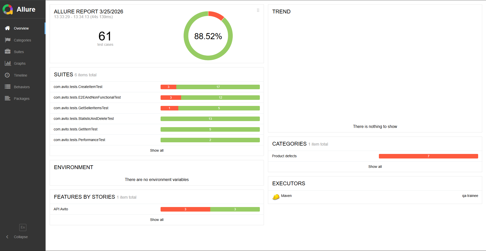

# Тестовое задание на позицию стажера-QA

## Описание проекта

Проект содержит два задания:

1. **Задание 1** — поиск багов на скриншотах интерфейса Avito (файл [TASK1.md](TASK1.md))
2. **Задание 2** — автоматизация тестирования API объявлений Avito

Данный README относится ко второй части задания.

## Задание 2: API Автотесты

Автоматизированы тесты для эндпоинтов:

| Метод  | Эндпоинт                 | Описание                           |
|--------|--------------------------|------------------------------------|
| POST   | `/api/1/item`            | Создание объявления                |
| GET    | `/api/1/item/{id}`       | Получение объявления по ID         |
| GET    | `/api/1/{sellerID}/item` | Получение всех объявлений продавца |
| GET    | `/api/1/statistic/{id}`  | Получение статистики (v1)          |
| GET    | `/api/2/statistic/{id}`  | Получение статистики (v2)          |
| DELETE | `/api/2/item/{id}`       | Удаление объявления                |

### Технологии

- Java 17
- Maven 4.0.0
- JUnit 5.10.1
- RestAssured 5.4.0
- Allure 2.25.0
- Jackson 2.16.1

## Запуск тестов

### Требования

- Java 17
- Maven 3.6+

### Быстрый старт

```bash
# Клонировать репозиторий
git clone https://github.com/xingsir12/avito-qa-trainee.git

# Перейти в корневую папку 
cd avito-qa-trainee

# Запустить все тесты
mvn clean test
```

### Запуск отдельных тестов

```bash
# Запустить конкретный тестовый класс
mvn test -Dtest=CreateItemTest

# Запустить конкретный тест
mvn test -Dtest=CreateItemTest#createItem_validData_returns200
```

## Allure отчет

### Генерация и открытие отчета

```bash
# Сгенерировать отчет
mvn allure:report

# Открыть отчет в браузере
mvn allure:serve
```

### Результаты Allure

- **Всего тестов:** 61
- **Успешно:** 54
- **Провалено:** 7 (из-за дефектов API)
- **Время выполнения:** ~44 секунд



## Результаты тестирования

### Найденные дефекты API

Всего обнаружено 7 дефектов. Подробное описание в [BUGS.md](BUGS.md):

| ID      | Название                                      | Серьезность |
|---------|-----------------------------------------------|-------------|
| BUG-001 | Нулевая статистика возвращает 400             | Critical    |
| BUG-002 | Отрицательная цена принимается                | High        |
| BUG-003 | Отрицательная статистика принимается          | High        |
| BUG-004 | В ответе POST отсутствует createdAt           | Medium      |
| BUG-005 | OPTIONS метод возвращает 405                  | Minor       |
| BUG-006 | Список объявлений не сортируется по createdAt | Medium      |
| BUG-007 | name=255 символов возвращает 400              | Medium      |

### Тест-кейсы

Все тест-кейсы (60 шт.) описаны в [TESTCASES.md](TESTCASES.md).

## Документация

| Файл | Описание |
|------|----------|
| [TASK1.md](TASK1.md) | Задание 1: баги на скриншотах (12 багов) |
| [TESTCASES.md](TESTCASES.md) | Тест-кейсы для API (60 шт.) |
| [BUGS.md](BUGS.md) | Баг-репорты по API (7 шт.) |

## Важные замечания

### Устойчивость к внешним данным

Тесты разработаны с учетом того, что тестовый стенд **общий**:

- Каждое созданное объявление использует уникальный `sellerID` (111111–999999)
- Тесты не зависят от существующих данных
- Все проверки работают с данными, созданными в рамках текущего запуска

### Известные ограничения

Из-за дефектов API (BUG-001, BUG-002, BUG-003) некоторые позитивные сценарии требуют workaround:
- Вместо нулевой статистики используются значения `1`
- Отрицательные значения тестируются в негативных сценариях

После исправления API тесты будут обновлены.

---

**Выполнил:** Чигрин Д.А.  
**Дата:** 2026-03-25