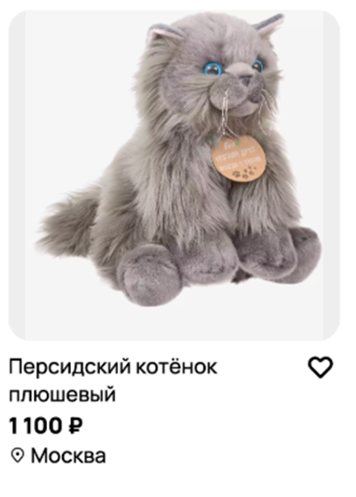
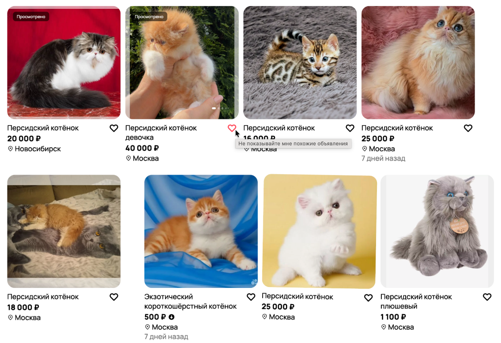
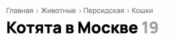
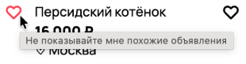
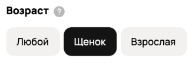

# Задание 1.1. Баг-репорты по скриншоту

**Дата:** 2026-03-21
**Проверяющий:** Чигрин Д.А.

## ▎Bug 1.1
|                       |                                                                                                                                                                                            |
|:----------------------|:-------------------------------------------------------------------------------------------------------------------------------------------------------------------------------------------|
| Проект                | Avito.ru                                                                                                                                                                                   |
| Локация               | Блок выдачи объявлений                                                                                                                                                                     |
| Описание              | При выбранном фильтре породы «Персидская» в выдаче отображается объявление о «Экзотическом короткошёрстном» котёнке.  В тексте объявления и в карточке отсутствует слово «персидская». |
| Приоритет (Priority)  | P1                                                                                                                                                                                         |
| Ожидаемый результат   | В выдаче по фильтру «Персидская» отображаются только объявления, относящиеся к персидской породе.                                                                                          |
| Фактический результат | Отображается объявление о другой породе (экзотический короткошёрстный).                                                                                                                    |

## ▎Bug 1.2
|                       |                                                                                                                                                                                     |
|:----------------------|:------------------------------------------------------------------------------------------------------------------------------------------------------------------------------------|
| Проект                | Avito.ru                                                                                                                                                                            |
| Локация               | Блок выдачи объявлений                                                                                                                                                              |
| Описание              | В разделе «Животные › Кошки» отображается объявление о плюшевой игрушке (текст объявления: «Персидский котёнок плюшевый»).  Объявление не относится к категории живых животных. |
| Приоритет (Priority)  | P1                                                                                                                                                                                  |
| Ожидаемый результат   | Отображаются только объявления о живых котятах                                                                                                                                      |
| Фактический результат | Отображается объявление о плюшевой игрушке.                                                                                                                                         |

## ▎Bug 1.3
|                       |                                                                                                                                                                                                                                  |
|:----------------------|:---------------------------------------------------------------------------------------------------------------------------------------------------------------------------------------------------------------------------------|
| Проект                | Avito.ru                                                                                                                                                                                                                         |
| Локация               | Боковая панель, заголовок страницы, кнопка фильтров                                                                                                                                                                              |
| Описание              | На странице отображается некорректное количество объявлений. В заголовке указано «Котята в Москве 19», а кнопка «Показать объявления» содержит число «8».  Количество объявлений не совпадает в разных элементах интерфейса. |
| Приоритет (Priority)  | P2                                                                                                                                                                                                                               |
| Ожидаемый результат   | Количество объявлений в заголовке и в кнопке «Показать объявления» совпадает и соответствует фактическому количеству объявлений в выдаче.                                                                                        |
| Фактический результат | Заголовок показывает «19», кнопка — «8».                                                                                                                                                                                         |

## ▎Bug 1.4
|                       |                                                                                                                                                                                                                                                                              |
|:----------------------|:-----------------------------------------------------------------------------------------------------------------------------------------------------------------------------------------------------------------------------------------------------------------------------|
| Проект                | Avito.ru                                                                                                                                                                                                                                                                     |
| Локация               | Над блоком «Уведомлять о новых»                                                                                                                                                                                                                                              |
| Описание              | При загрузке страницы рядом с элементом «Уведомлять о новых» мелким неконтрастным шрифтом отображается сообщение «Ошибка, обновите страницу».  Сообщение не блокирует интерфейс, не поясняет причину ошибки и не соответствует стандартным паттернам отображения ошибок. |
| Приоритет (Priority)  | P2                                                                                                                                                                                                                                                                           |
| Ожидаемый результат   | При возникновении ошибки загрузки страницы пользователь видит заметное сообщение (нормальным размером, с белым фоном), которое информирует о проблеме и предлагает действие (например, кнопку «Повторить» или ссылку на обновление страницы).                                |
| Фактический результат | Отображается мелкий текст «Ошибка, обновите страницу», который легко пропустить.                                                                                                                                                                                             |

## ▎Bug 1.5
|                       |                                                                                                                                                                                     |
|:----------------------|:------------------------------------------------------------------------------------------------------------------------------------------------------------------------------------|
| Проект                | Avito.ru                                                                                                                                                                            |
| Локация               | Блок выдачи объявлений, карточки товара                                                                                                                                             |
| Описание              | Нарушена единообразная сетка (грид) карточек объявлений. Из-за увеличенного отступа между карточками.  Три карточки сместились вправо, нарушив выравнивание.                    |
| Приоритет (Priority)  | P2                                                                                                                                                                                  |
| Ожидаемый результат   | Все карточки объявлений выровнены по сетке, отступы единообразны, карточки не смещаются вправо.                                                                                     |
| Фактический результат | Увеличен отступ между карточками, три карточки съехали вправо, сетка нарушена.                                                                                                      |

## ▎Bug 1.6
|                       |                                                                         | 
|:----------------------|:------------------------------------------------------------------------|
| Проект                | Avito.ru                                                                |
| Локация               | Навигационная панель                                                    |
| Описание              | Хлебные крошки: некорректный порядок вложенности категорий в навигации. |
| Приоритет (Priority)  | P3                                                                      |
| Ожидаемый результат   | «Главная › Животные › Кошки › Персидская»                               |
| Фактический результат | Отображается как «Главная › Животные › Персидская › Кошки»              |

## ▎Bug 1.7
|                       |                                                                                                                                                                       |
|:----------------------|:----------------------------------------------------------------------------------------------------------------------------------------------------------------------|
| Проект                | Avito.ru                                                                                                                                                              |
| Локация               | Блок фильтрации по региону / геолокации                                                                                                                               |
| Описание              | В фильтре геолокации отображается «Сначала из Можайска», хотя основным регионом поиска указана Москва.  Вероятно, подтягивается некорректное значение геопозиции. |
| Приоритет (Priority)  | P3                                                                                                                                                                    |
| Ожидаемый результат   | «Сначала из Москвы»                                                                                                                                                   |
| Фактический результат | Отображается как «Сначала из Можайска»                                                                                                                                |

## ▎Bug 1.8
|                       |                                                                                                                                                                  |
|:----------------------|:-----------------------------------------------------------------------------------------------------------------------------------------------------------------|
| Проект                | Avito.ru                                                                                                                                                         |
| Локация               | Карточка товара                                                                                                                                                  |
| Описание              | При наведении на карточку вместо стандартных действий «Добавить в избранное» и «Сравнение» появляется всплывающий текст «Не показывайте мне похожие объявления». |
| Приоритет (Priority)  | P3                                                                                                                                                               |
| Ожидаемый результат   | Всплывающая подсказка для карточки объявления предлагает «Добавить в избранное» и «Сравнение».                                                                   |
| Фактический результат | Отображается текст подсказки «Не показывайте мне похожие объявления»                                                                                             |

## ▎Bug 1.9
|                       |                                                                                                                                                                               |
|:----------------------|:------------------------------------------------------------------------------------------------------------------------------------------------------------------------------|
| Проект                | Avito.ru                                                                                                                                                                      |
| Локация               | Боковая панель, блок фильтров, пункт «Возраст»                                                                                                                                |
| Описание              | В фильтре возраста для категории «Кошки» используется термин «Щенок» (корректно — «Котёнок»).  Также наблюдается несогласование рода: «Щенок» (м.р.) и «Взрослая» (ж.р.). |
| Приоритет (Priority)  | P3                                                                                                                                                                            |
| Ожидаемый результат   | «Любой / Котёнок / Взрослая» (или «Взрослая» с согласованием по роду)                                                                                                         |
| Фактический результат | Отображается: «Любой / Щенок / Взрослая».                                                                                                                                     |

## ▎Bug 1.10
|                       |                                                                                          |
|:----------------------|:-----------------------------------------------------------------------------------------|
| Проект                | Avito.ru                                                                                 |
| Локация               | Верхняя навигационная панель (хедер)                                                     |
| Описание              | Допущена орфографическая ошибка: вместо «Карьера в Авито» отображается «Коръера в Авито» |
| Приоритет (Priority)  | P3                                                                                       |
| Ожидаемый результат   | «Карьера в Авито»                                                                        |
| Фактический результат | Отображается «Коръера в Авито»                                                           |

## ▎Bug 1.11
|                       |                                                                                                                            |
|:----------------------|:---------------------------------------------------------------------------------------------------------------------------|
| Проект                | Avito.ru                                                                                                                   |
| Локация               | Над блоком выдачи объявлений (над блоком объявлений)                                                                       |
| Описание              | В тексте элемента интерфейса допущена орфографическая ошибка: вместо «Уведомлять о новых» отображается «Уведомять о новых» |
| Приоритет (Priority)  | P3                                                                                                                         |
| Ожидаемый результат   | «Уведомлять о новых»                                                                                                       |
| Фактический результат | Отображается «Уведомять о новых»                                                                                           |

## ▎Bug 1.12
|                       |                                                                                                                                                    |
|:----------------------|:---------------------------------------------------------------------------------------------------------------------------------------------------|
| Проект                | Avito.ru                                                                                                                                           |
| Локация               | Карточка товара                                                                                                                                    |
| Описание              | Карточка объявления отображается с небольшим наклоном вправо, в то время как остальные карточки в выдаче имеют ровное (вертикальное) расположение. |
| Приоритет (Priority)  | P3                                                                                                                                                 |
| Ожидаемый результат   | Все карточки объявлений отображаются ровно, без наклона, согласно дизайн-системе.                                                                  |
| Фактический результат | Одна из карточек имеет визуальный наклон вправо.                                                                                                   |

